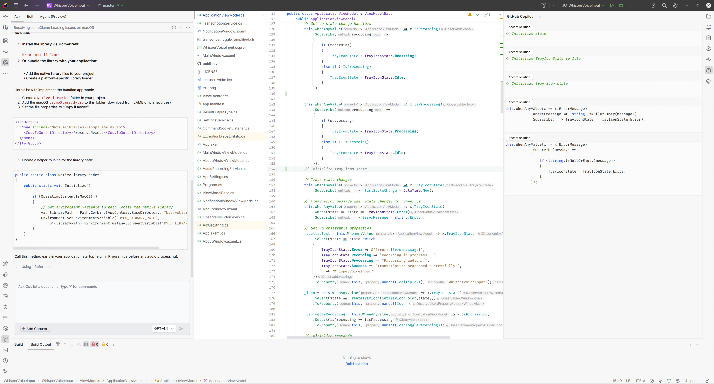
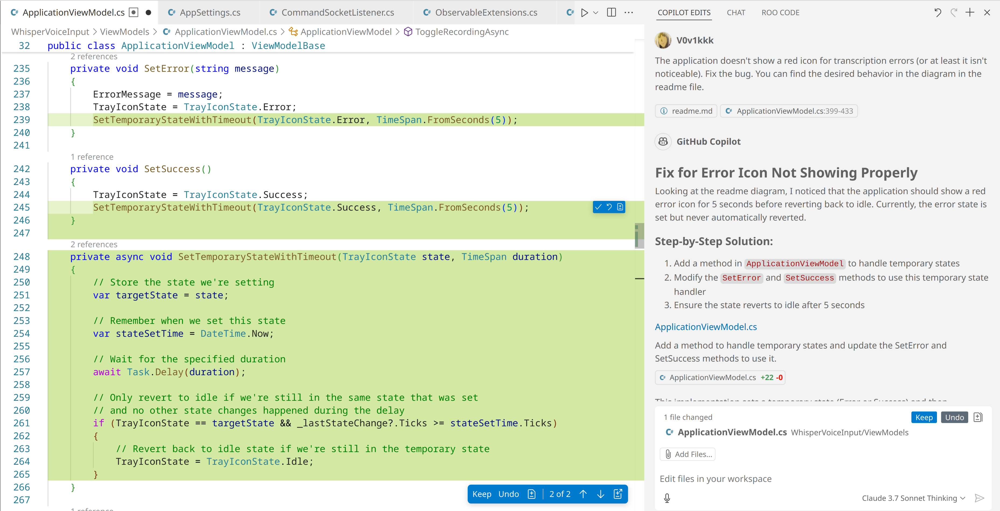
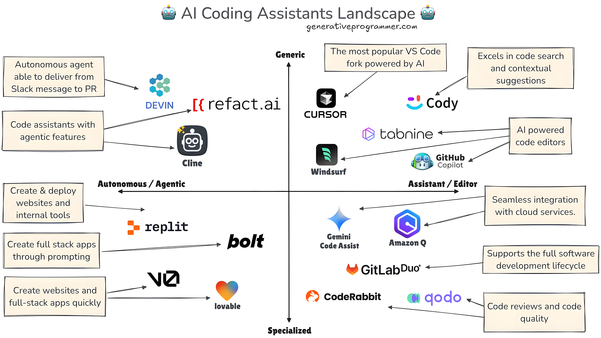
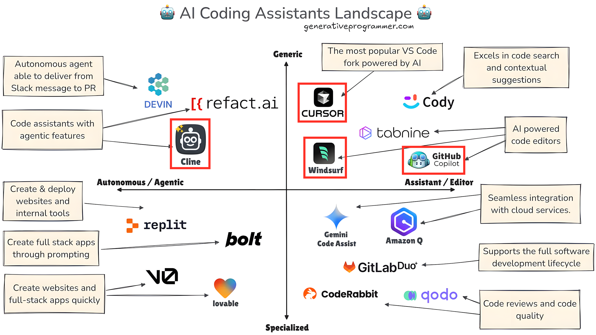
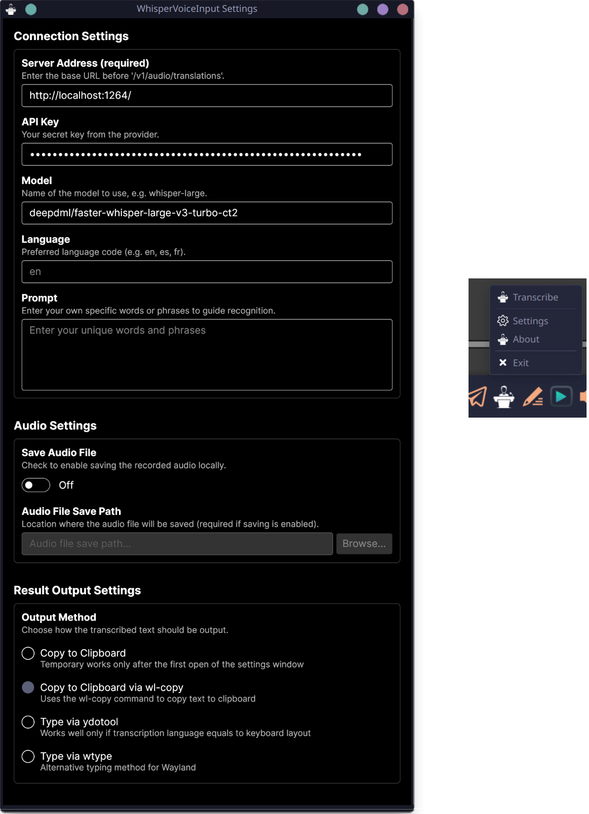
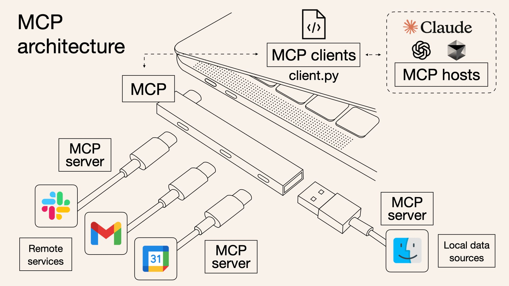
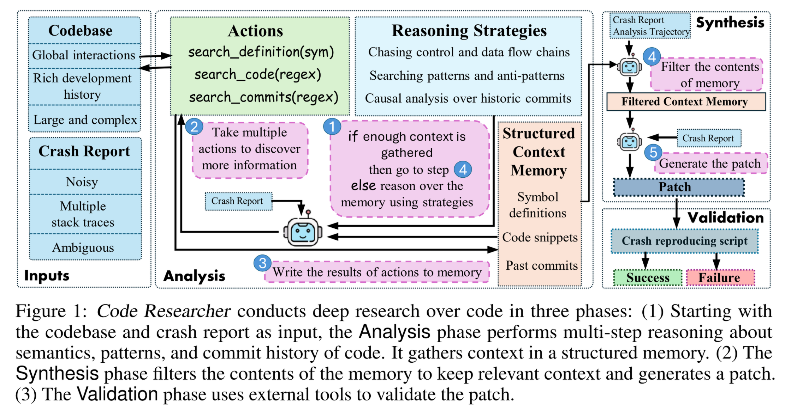
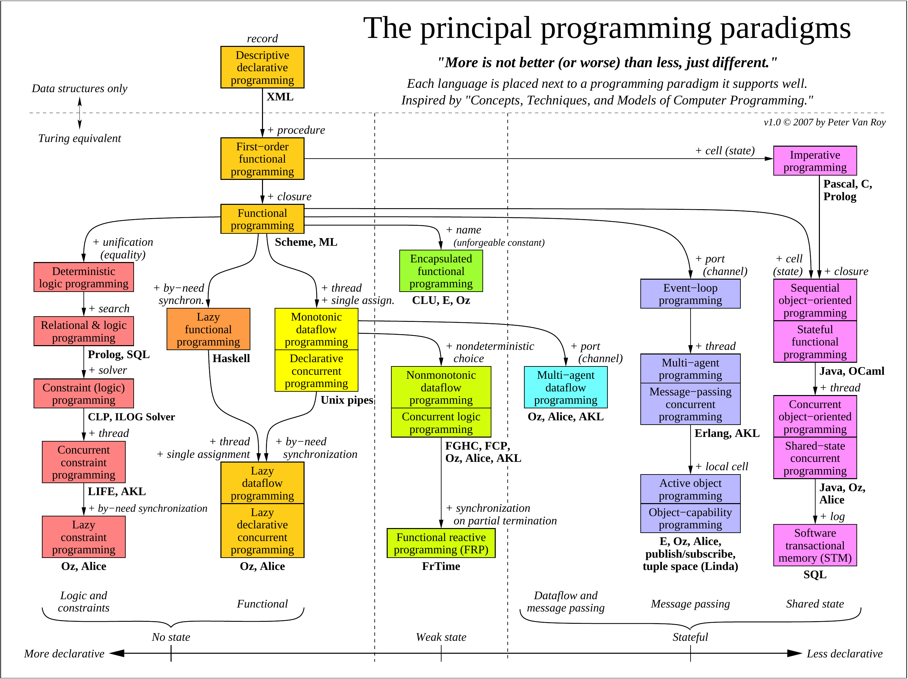
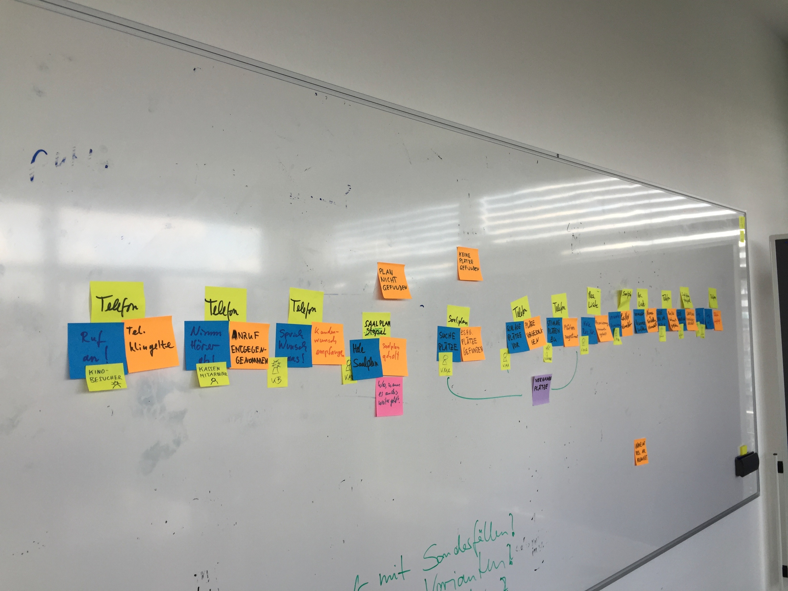

---
tags:
  - presentation
creationTime: 2025-01-08 21:46:45
---
  
 <style>

  :root {
    /* Global Mermaid settings - applied to all diagrams */
    --mermaid-global-theme: 'default';        /* Forest theme by default */
    --mermaid-global-scale: 1.0;             /* Standard scale */
    --mermaid-global-width: 1000;            /* Diagram width */
    --mermaid-global-height: 600;            /* Diagram height */
    --mermaid-global-background: 'transparent';    /* Background color */
  }

/* 
%%{init: {'look': 'neo', 'theme': 'neo'}}%% 
%%{init: {
  'theme': 'base',
  'themeVariables': {
    'primaryColor': '#BB2528',
    'primaryTextColor': '#fff',
    'primaryBorderColor': '#7C0000',
    'lineColor': '#F8B229',
    'secondaryColor': '#006100',
    'tertiaryColor': '#fff'
  }
}}%%

%%{wrap}%%
%%{init: {'flowchart': {'useMaxWidth': true}}}%%

%%{init: {'theme':'dark', 'themeVariables': { 'primaryColor': '#ff0000'}}}%%

%%{init: {'flowchart': {'useWidth': 800}}}%%
*/

  /* ==========Size Classes for Diagrams==================== */
  .mermaid-container {
    display: flex;
    justify-content: center;
    align-items: center;
    margin: 1em 0;
    width: 100%;
    height: auto;
  }

  .mermaid-container svg {
    max-width: 100%;
    height: auto;
    display: block;
  }

  /* ==========Size Control==================== */
  .mermaid-small .mermaid-container svg {
    transform: scale(0.7);
  }
  .mermaid-medium .mermaid-container svg {
    transform: scale(0.9);
  }
  .mermaid-large .mermaid-container svg {
    transform: scale(1.2);
  }

  /* ==========Positioning==================== */
  .mermaid-left .mermaid-container {
    justify-content: flex-start;
  }
  .mermaid-right .mermaid-container {
    justify-content: flex-end;
  }
  .mermaid-float-left .mermaid-container {
    float: left;
    margin-right: 2em;
    width: 40%;
  }
  .mermaid-float-right .mermaid-container {
    float: right;
    margin-left: 2em;
    width: 40%;
  }

/* ==========General styles==================== */

 .inline-img {
   height: 1.5em;
   vertical-align: middle;
 }

  section.section-header h1 {
	  color: white;
	  background-color: rgba(7.5, 14.1, 21.6, 0.9);
	  padding: 0.5em;
	  text-align: center;
  }  

/* ==========Slide with a big image and a title at the top==================== */

  /* The main class for a slide with a big image and a title at the top */
  section.big-image {
    /* Use flex to position elements vertically */
    display: flex;
    flex-direction: column;
    /* Occupy the full height of the slide (Marp enforces 16:9) */
    height: 100%;
    margin: 0 !important;
    padding: 0 !important;
  }

  /* Title (h2) at the top */
  section.big-image h2 {
    margin: 0 !important;
    /* Slight padding for readability; adjust if needed */
    padding: 0.5em 0 !important;
    text-align: center;
  }  

  /*
   * When inserting an image via Markdown (  ),
   * it will be wrapped in <p>. We'll turn <p> into a flexible container.
   */
  section.big-image p {
    margin: 0 !important;
    padding: 0 !important;
    flex: 1;                /* fill all remaining height below the title */
    display: flex;
    align-items: center;    /* vertical centering */
    justify-content: center;/* horizontal centering */
    overflow: hidden;       /* if something exceeds, it will be clipped */
  }

  /* The image itself */
  section.big-image p img {
    margin: 0 !important;
    padding: 0 !important;
    max-width: 100%;
    max-height: 100%;
    display: block;
    object-fit: contain; /* ensures the entire image is shown without cropping */
  }

  /* ==========Big Diagram Layout==================== */
  /* The main class for a slide with a big diagram and a title at the top */
  section.big-diagram {
    /* Use flex to position elements vertically */
    display: flex;
    flex-direction: column;
    /* Occupy the full height of the slide (Marp enforces 16:9) */
    height: 100%;
    margin: 0 !important;
    padding: 0 !important;
  }

  /* Title (h1/h2) at the top */
  section.big-diagram h1,
  section.big-diagram h2 {
    margin: 0 !important;
    /* Slight padding for readability; adjust if needed */
    padding: 0.5em 0 !important;
    text-align: center;
  }

  /* Container for the mermaid diagram */
  section.big-diagram .mermaid-container {
    margin: 0 !important;
    padding: 0 !important;
    flex: 1;                /* fill all remaining height below the title */
    display: flex;
    align-items: center;    /* vertical centering */
    justify-content: center;/* horizontal centering */
    overflow: hidden;       /* if something exceeds, it will be clipped */
    width: 100%;
    height: auto;
  }

  /* The SVG itself */
  section.big-diagram .mermaid-container svg {
    margin: 0 !important;
    padding: 0 !important;
    max-width: 100%;
    max-height: 100%;
    display: block;
  }

  /* Fix for foreignObject text displacement in big-diagram mode */
  section.big-diagram .mermaid-container svg foreignObject {
    overflow: visible !important;
  }
  
  section.big-diagram .mermaid-container svg foreignObject > div {
    transform-origin: 0 0 !important;
    white-space: nowrap !important;
    overflow: visible !important;
  }
  
  /* Specific fixes for flowchart nodes */
  section.big-diagram .mermaid-container svg .node foreignObject div {
    display: flex !important;
    align-items: center !important;
    justify-content: center !important;
    height: 100% !important;
    box-sizing: border-box !important;
  }
  
  /* Class diagram specific fixes */
  section.big-diagram .mermaid-container svg .classBox foreignObject div {
    padding: 4px !important;
    line-height: 1.2 !important;
  }

/* ================About me slide======================== */

  /* Updated CSS Grid styles will go here */
  section.about-me {
    display: grid;
    /* Define columns for the content area below the title */
    grid-template-columns: 46% 1fr;
    /* Define rows: Auto height for title, 1fr for remaining content area */
    grid-template-rows: auto 1fr;
    column-gap: 30px;  /* Horizontal gap between content columns */
    row-gap: 15px;     /* Vertical gap between title and content columns */
    width: 100%;
    height: 100%;      /* Ensure grid takes full slide height */
    box-sizing: border-box;
    font-size: 1.8em;  /* Keep previous font size adjustment */
    line-height: 1.4;  /* Keep previous line height adjustment */
    padding-top: 10px;
  }

  /* Style the H2 title and place it */
  section.about-me > h2 {
    grid-column: 1 / 3; /* Make title span columns 1 and 2 */
    grid-row: 1;        /* Place title in the first row */
    text-align: center; /* Center the title */
    margin: 0 0 5px 0;  /* Adjust margins (reduced bottom margin) */
    padding: 0 !important;         /* Reset padding */
    font-size: 1.6em;   /* Control title size (adjust as needed) */
    border-bottom: 1px solid var(--borderColor-muted); /* Optional: add underline */
    padding-bottom: 5px; /* Optional: space for underline */
  }

  /* Place left column */
  section.about-me > .column-left {
    grid-column: 1;     /* First column */
    grid-row: 2;        /* Second row (below title) */
    min-width: 0;       /* Prevent overflow issues */
    align-self: start;  /* Align content to top of its grid area */
  }

  /* Place right column */
  section.about-me > .column-right {
    grid-column: 2;     /* Second column */
    grid-row: 2;        /* Second row (below title) */
    text-align: center;
    min-width: 0;       /* Prevent overflow issues */
    align-self: start;  /* Align content to top of its grid area */
    padding-top: 10px;  /* Keep padding above photo */
  }

  /* --- Keep other styles for lists, photo, spacing etc. --- */
  section.about-me ul { margin-top: 4px; margin-bottom: 8px; padding-left: 20px; }
  section.about-me ul ul { margin-top: 2px; padding-left: 25px; }
  section.about-me li { margin-bottom: 3px; }
  section.about-me .profile-photo { max-width: 430px; height: auto; border-radius: 50%; margin-bottom: 15px; }
  section.about-me .inline-img { height: 1.1em; vertical-align: middle; margin-left: 5px; }
  section.about-me .social-links ul { list-style: none; padding: 0; margin: 0; }
  section.about-me .social-links li { margin-bottom: 8px; }
  section.about-me .social-links img.social-icon { width: 38px; height: 38px; vertical-align: middle; margin-right: 8px; }
  section.about-me .social-links h3 { margin-top: 0; margin-bottom: 10px; font-size: 1.0em; }

/* ============Columns============================ */

  .columns {
    display: flex;
    /* 1. Set a width for the columns container */
    width: 90%; 
    /* 2. Center the container on the slide */
    margin: 0 auto;
    /* 3. Define the gap between columns */
    gap: 2rem;
  }
  .columns > .column {
    flex: 1;
    min-width: 0;
  }

</style>

<!-- _class: section-header -->
# Programming with AI:<br/>The Human Edge in an AI-Driven World


<!--

Hello my name is Vladimir and today we will talk about AI and how it changed landscape of software engineering.

As a lot a people nowadays I question myself how I can use LLM's to boost my productivity.
For me personally it's important to stay up-to-date.
Not so much now as in the future.

-->

---

<!-- _class: about-me -->

## About me

<div class="column-left">
    <ul>
        <li><strong>Briefly:</strong>
            <ul>
                <li>From Ural region</li>
                <li>More than 8 years in development</li>
            </ul>
        </li>
        <li><strong>Professional interests:</strong>
            <ul>
                <li>Web API development</li>
                <li>Reactive systems</li>
                <li>Observability</li>
                <li>C#/F#</li>
                <li>Roslyn</li>
            </ul>
        </li>
        <li><strong>Hobby:</strong>
            <ul>
                <li>Smart home</li>
                <li>Applicable AI</li>
                <li>Arch Linux </li>
            </ul>
        </li>
    </ul>
</div>
<div class="column-right">
	
	<div class="social-links">
	  <h3>Connect</h3>
	  <ul>
		<li>
		  
		  <a href="https://t.me/V0v1kkk" target="_blank">Telegram</a>
		</li>
		<li>
		  
		  <a href="https://www.linkedin.com/in/v0v1kkk/" target="_blank">LinkedIn</a>
		</li>
	  </ul>
    </div>
</div>

<!-- 

Let me say a few words about myself before we go to the main topic.  
I'm not the CEO of Anthropic, I'm just an AI enthusiast, a guy next door whom you might find in any office of our company.

I’m a .NET developer with eight years of experience, primarily using C#. 
However, I believe F# is an exceptional language and that functional programming offers clear advantages over object-oriented approaches—feel free to dispute on this with me after the talk.  

I enjoy working with my smart home installation and I have recently focused on making AI my daily driver. 
And also I spent a lot of time troubleshooting with my operating system which is Arch Linux, by the way.

At the end of self presentation part:
...And also THIS is my first time to give a speech in front of an audience in a foreign language. 
So please go easy on me.

Now, let’s return to our main topic.

-->

---
<style scoped>
section {
    font-size: 25px;  
}
</style>

## AI as a Power Tool for Devs

Modern AI models significantly enhance developer capabilities in several key areas:

- **Unmatched Speed & Efficiency:** AI rapidly generates boilerplate code (e.g., data access layers, unit test skeletons), automates routine tasks, and accelerates prototyping.
- **Large-Scale Code Comprehension:** Maintains long context (e.g., GPT-4, Gemini) to effectively process large codebases or documentation, assisting in reviews and refactoring complex scripts.
- **Accelerated Learning & Ideation:** Helps developers quickly grasp new technologies with instant examples/explanations and supports rapid prototyping of ideas.
- **Democratising Development:** Lowers the entry barrier, enabling more people to build applications with AI assistance, often via natural language.

<!--

Before we jump into the scary stuff, let’s start with the good news.  

Modern LLMs give us a real productivity boost. 
They generate boiler-plate in seconds, effortlessly review huge files, and speak every language from Bash to F#.

For me the biggest win is speed: I ask for a test skeleton, sip coffee, and it’s done. 

Second win – context.
Cutting edge LLM's can digest enormous amount of information. A lot of source code, various specifications, documentation and still remember what I asked two minutes ago. 
That makes many once-boring tasks completely painless.

Third – education. 
Need a Rust example? Just ask. The model is a patient tutor that never rolls its eyes.

Finally, AI lowers the entry bar: product managers, QAs, even my neighbour can build a quick script now.  
And what important is, all this power is additive. 
We still own the architecture and business logic. 
Keep that in mind, because the next slide shows what happens when companies forget it…

-->

---

<style scoped>
section {
    font-size: 21px;   
} 
</style>

## Layoffs, Re-skilling, Reality

| Company                                                                                                             | Announced            | Affected (Approx.)      | Stated Reason / AI Link (Focus on Developers)                                                                                                                                                    |
| ------------------------------------------------------------------------------------------------------------------- | -------------------- | ----------------------- | ------------------------------------------------------------------------------------------------------------------------------------------------------------------------------------------------ |
| **[Microsoft](https://www.the420.in/microsoft-layoffs-2025-ai-engineers-job-loss-openai-tools-impact/)**            | May 2025             | ~6,000 (many dev roles) | Restructuring for AI focus; boosting efficiency. Some laid-off engineers were previously encouraged to adopt AI for coding. ([Source](https://www.finalroundai.com/blog/ai-replacing-jobs-2025)) |
| **[IBM](https://aimresearch.co/market-industry/ceos-are-replacing-workers-one-ai-at-a-time)**                       | Early 2025 & ongoing | 8,000+ (various roles)  | "Workforce rebalancing" to free up capital for AI investment; AI replacing back-office roles. *Developer impact often indirect via restructuring towards AI skills.*                             |
| **[Autodesk](https://aimresearch.co/market-industry/2025s-tech-and-corporate-layoffs-portend-the-impact-of-ai)**    | Feb 2025             | ~1,350 (9% of staff)    | Restructuring to "accelerate investments in AI and cloud technologies"; shifting resources, implying changes in needed developer skillsets.                                                      |
| **[CrowdStrike](https://aimresearch.co/market-industry/2025s-tech-and-corporate-layoffs-portend-the-impact-of-ai)** | May 2025             | ~500 (5% of staff)      | CEO: "AI flattens our hiring curve"; AI-driven efficiencies impacting future hiring needs, including developers.                                                                                 |

*Note: Figures and reasons based on public reports. The direct replacement of developers by AI is a complex, evolving narrative.*

<!--
Great powers always come with plot twists. 

Since late 2024 we’ve seen a wave of layoffs and almost every press-release contains the magic letters ‘A I’.  It's everywhere.

Microsoft let 6k people go in May-25 while telling the rest to write ‘50% of code with Copilot’. 
AI is not an option anymore.

IBM, Autodesk, CrowdStrike – same pattern: ‘We need to re-balance, free budget, focus on AI.’

So the message is: adapt or be re-balanced.

And it’s not only about cost.
Boards see AI as a strategic advantage, so they re-shape teams before rivals do.

Keep this in mind. In the next slide we’ll hear even bolder statements – some leaders claim coding itself is already obsolete. Let’s see how serious that is…

-->
---

<style scoped>
section {
    font-size: 25px;   
} 
</style>
## Is Coding Really Over?

Amidst workforce changes, pronouncements from tech leaders paint a picture of AI rapidly dominating software development:

-   **Dario Amodei (CEO, Anthropic), [March 2025](https://www.businessinsider.com/anthropic-ceo-dario-amodei-ai-write-code-humans-2025-3):** *Predicted AI will write "90% of the code" in 3-6 months, and "essentially all of the code" in 12 months.*
-   **Sam Altman (CEO, OpenAI), [March 2025](https://m.economictimes.com/news/new-updates/90-of-coding-by-ai-fewer-jobs-for-software-engineers-zohos-sridhar-vembu-and-openais-sam-altman-give-techies-a-reality-check/articleshow/119333225.cms):** *“Maybe we do need less software engineers.”* (Also noted AI is *"probably past 50% now"* for writing code in many companies).
-   **Mark Zuckerberg (CEO, Meta), [Jan/Feb 2025](https://www.salesforceben.com/salesforce-ceo-marc-benioff-no-more-software-engineers-in-2025-due-to-30-ai-productivity-boost/):** *Indicated AI engineers would build much of Meta's code, potentially acting as "mid-level engineers."*
-   **Amjad Masad (CEO, Replit), [March 2025](https://developers.slashdot.org/story/25/03/31/1623201/no-longer-think-you-should-learn-to-code-says-ceo-of-ai-coding-startup):** *Stated, “I no longer think you should learn to code.”*

*Additional context: OpenAI's CFO also announced (Apr 2025) development of "A-SWE", an AI agent to holistically replace software engineers.*

<!--

Now the headlines are way over the top.

A lot of famous speakers claims that coding is almost dead and in the near future we all will be replaced by AI. 
You can see some of the claims on the slide.

These quotes are great for investors but they ignore daily reality. 
AI still needs prompts, context and reviewers. 
It also hallucinates – and it never stays late to fix production.

So I read such claims as a weather forecast: sunny, maybe; bring an umbrella anyway.  

What these bold claims do is raise expectations within companies—managers expect a miracle.

However, we shouldn't blindly believe that coding is dead or that developers will be obsolete overnight. 
Instead, we need to understand why these claims are made and then focus on how we can actually leverage AI as a tool. 

And that’s exactly what we'll be diving into in the main part of this presentation: the techniques, tools, and mindset needed to effectively program with AI.

-->
---

<!-- _class: big-image -->
## StackOverflow is dying


<!--

The first obvious thing which everyone tried to do when ChatGPT has released was asking questions, which we usually asked on StackOverflow before, and of course generating small snippets, separate methods and classes.

As the result of the trend, StackOverflow was started rapidly dying.
Even owners of the site accepted the inevitable and sold all the site data for LLM's training.

(interactive)
Please raise your hand if you are a developer.
And now leave arms raised who noticed that start using StackOverflow less frequently.

-->

---
<!-- _class: section-header -->
# Programming with AI - Playing in the sandbox


<!--

Let’s start from the very beginning.
Returning to generating small pieces of code...

-->
---

<style scoped>
section {
    font-size: 26px;   
} 
</style>
## Level 0 - Using LLMs in chat mode

- Ask for technology/library/framework usage examples
- Use basic promt engineering
	- Zero-Shot Prompting
		- *"Replace all service-locator usages for constructor injection"*
		- *"Write unit tests for the class with NUnit"*
	- One-Shot Prompting
		- *"Using style of provided unit-tests analyse equivalence classes of all input parameters of the method X and extend code coverage"*
	- Few-Shot Prompting
- Don't forget to reset context (create new chat)
- Decompose your task for multiple promts
- Use structured outputs (JSON)

<!--

I defined it as a level zero of programming with AI.

And what I found out when I was using AI in chat mode?

Firstly I would like to mention that sometimes LLM's could have more information about some particular API's that you can find in manuals.
For example, when I tried to use Roslyn Compiler API to write one tricky code analysis and struggled to find relevant information in the documentation and surprisingly I found out that ChatGPT knows much more than is written in the official documentation.


Secondly, it's important to choose right promting strategy.

If your task is common or straightforward, or if you trust the AI's general knowledge to get it right, just use zero-shot prompting without any examples.

If you need the AI to follow a specific format, style, or pattern that it might not guess correctly on its own, it's better to provide one or few examples of expected output.


The third advice might sound a bit obvious, however it's important to not forget to reset your context.
The main reason why it's so important is that modern large language model based on the transformer architecture and they just try to predict the next token.
If your context is contaminated with cluttering information such as side questions or misleading information an LLM might be struggling with processing your requests.


Fourthly, If your task looks complicated try to decompose it.
For example, you might feed an LLM your source files one by one and and ask to extract some information from them. And on the second step you can use that information in a new conversation to generate some new code.

For example, I used that approach to collect metric names from source files and then with that metrics names I generated some Grafana panels.

And finally, sometimes it might be useful to format an LLM output as JSON and then parse it with any other tool or script.
-->

---
<!-- _class: big-diagram -->
## Level 0 - Refactoring example


<!--

One more example of AI enhanced refactoring.

Recently, I had to separate data retrieval from usage via a DTO layer.
Considering that there were few dozens of similar files, and the refactoring looked too boring, I decided to use AI for the task.

First of all, I would need a prompt, but how can I get it?

On the first step I tried to refactor one file manually to have some material for requirement formalisation.
After a raw formalisation by myself, I've fed my initial promt with requirements and my the first input/output example and asked to refine the promt.

Then I created simple script which a bundled the refined promt, examples and files for refactoring one by one.

And finally every promt was been sent to an LLM.


What can I say is that the result was pretty decent and was used almost without correction.
Here I can consider that the approach might work for monotonic refactoring of similar files.

-->

---
<!-- _class: big-image -->
## Level 1 - Auto-completion


<!--

The next helpful, however a little bit controversial thing is auto-completion.

On one hand it's so convenient to write a few lines of code and see that your intention has been predicted and the next code block just waits for your approval.

Moreover, sometimes it is enough to write comments for a method to see the whole the method implementation. As on the slide.

It was a real time-saver for me when I started my experiments with AI-related libraries in Python, the programming language which I didn't know.

The major downside here is that auto-completion might be misleading or contain something similar to what you want, but not exactly. 
Every time when your IDE shows you auto-completion, you have to read it, understand it and decide if it exactly want you wanted.

In a long run it might be too distracting.
I've seen different feedback from developers on the internet. 
Some of them said that it accelerates their workflow, but some of them stays on the fact that reading all the auto-completions takes too much time.

(interactive)
Raise your hands who tried to use auto-completion
And now leave arms raised who thinks that it's more distract than help

Also I would like to share a little tip. Auto-completion can help with prompt writing.
That is. AI helps create prompts for AI. 
I've noticed that it accelerates promts crafting a lot.

-->

---
<!-- _class: section-header  -->
# Programming with AI (level 2) - Integrated tools



<!--

Let's do one more step in programming with AI.

-->
---
<!--   -->

<style scoped>
section {
    font-size: 20px;
    padding-left: 30px;
    padding-right: 30px;
}
</style>
## Simple task automation

- Tools examples: 
	- GitHub Copilot Edits (in non agentic mode)
	- JetBrains AI assistant
	- Aider
- Advantages
	- Can include context </br>(files from code-base, console output, git diff)
	- Some tools can provide voice input capabilities
- Covered task scope
	- Isolated code changes
	- Git commit message generation
	- Git diff review
	- Tests generation
	- Documentation generation


<!--

Level 2 tools in my terminology are more integrated with IDE and code editors and able to retrieve context from code-base, console output or from git diff.
Sometimes they are capable to perform semantic search which increases assistant awareness a lot.

One of the gems I found in tooling of that level is commit messages generation.
It's a relief for me. 
Previously I often collected a lot of changes before commit them, just because I'm too lazy to write commit message.
Now I just click one button, and that's all.


Some of you might argue that writing commit messages is a useful pause to reflect on what’s been done. 

And I agree. It's 100% reasonable when you squash all you commits and ready to deliver a result.
However, as we will see on the next levels with frequent iterations on code-base with AI, fast and frequent commits become crucial because you want to be able to roll back at any moment without losing progress.

Technically, that tooling are pretty similar to the level zero but more convenient and time-saving.

And on the slide you could see in action two implementations of commit message generation.
One by GitHub copilot and one by VS Code extension extension named Cline.
Also I tried to show some kind of automatic commit review by GitHub Copilot and including data into the Copilot context.

Automatic code review can technically help catch oversight errors. 
However, I haven’t had the chance to try it on a large codebase yet.

-->

---
<!-- _class: big-image -->
## Copilot Edits Example



<!--

It's a little example how Copilot Edits looks. 

You just write your prompt, include necessary files or instruct the copilot how to find necessary files by itself.
It performs operations and offer edits. Level two tooling usually edit only one file at once.

Particularly that offered solution was pretty bed, so I declined it.

-->

---

<!-- _class: section-header -->
# Programming with AI (level 3) - Agentic tools


<!--

And now let's discuss the almost highest level of programming with AI - assistants.

-->

---
<!-- _class: big-image -->
## Complex task automation



<!--

So, we've seen that Level 2 tools can perform specific tasks like editing code or generating commits, using project context. 

This capability naturally raises the question: what's the next evolution? 
If an AI can execute these discrete steps based on our prompts, why couldn't it handle a sequence of steps towards a larger goal? 

This is where we start thinking about more continuous or even agent-like operation. 

Picture this: you give the assistant a high-level task. 
Then it autonomously analyses the task, decomposes it into smaller steps, implements them, tries to build or run the result, checks logs and errors, and potentially adjusts its approach based on the feedback. 

This ability to manage a workflow of interconnected tasks is really the core idea behind the next level of AI tooling.

-->

---
<!-- _class: big-image -->
## Complex task automation



<!--

On the slide you could see the variety of available tools of this level. 
Further we will speak mostly about Cline and it's a fork that names a Roo Code which are extensions for Visual Studio Code.
And with which I played with.

Cursor and Windsurf in they turn are forks of Visual Studio Code with embedded AI capabilities.

Lately GitHub Copilot also received an agentic mode, which allowed it to stay in the same row with Cursor and Windsurf.
However, right now, GitHub Copilot is less powerful than the previous editors I mentioned.
-->

---
<!-- _class: big-image -->
## Cline AI assistant for VS Code


<!--

We've seen how third level tool can accomplish challenging but it's but still pretty small task.

But what about creating a whole application?
I was wondering as well and decided to try to create a simple desktop application using Cline.

On the slide, you can see a screenshot of Cline. 
It can read files, write files, execute terminal commands, browse the internet, even open the front end that it's developing, and so on.
And it can work with any OpenAI compatible API.

-->

---
<!-- _class: big-image -->
## Building a new application for voice input - The concept



<!--

Some time ago, I learned that OpenAI had released a good voice-to-text model with open weights. 
If you tried voice input in ChatGPT, that what I'm talking about.

After testing it on my local machine, I decided that I want a convenient tool for private voice transcribing. And at the same time I wanted to test the boundaries of cutting edge AI developer tooling.

On the slide you can see the final result.

-->

---

<!-- _class: big-image -->
## Building a new application for voice input - Fast markup


<!--

First of all to start you need to have a solid idea what you want to build.

In my case, I had only one the main user scenario with recording activation and transcribing by pressing a button on a keyboard.

Also, I had understood which settings are needed for connection to the transcribing model.

I began by sketching a mock-up on "a napkin" and feeding it to a large language model, asking it to generate markup for the AvaloniaUI framework, which I chose for this task.

-->

---

<!-- _class: big-diagram  -->
## Building a new application for voice input - Requirements description


<!--

In parallel, I created a textual description of the desired behaviour.  
I did that using voice input, by the way.  
And then requested it be reformatted into a state diagram in Mermaid format.  
After that, I just had to polish the draft diagram until it was perfect.

Midway through implementation, I realised I lacked sufficient technical expertise with cross-platform voice recording and encoding libraries.

So I used the Deep Research feature in GitHub (or Gemini). It doesn't really matter.
The key point is that it’s an effective way to quickly bridge short-term technical knowledge gaps.

-->

---
## Building a new application for voice input - Takeaways

- Agentic coding tools are capable to write the outline </br>of your application in case of guidance
- Voice input - must have. It speeds you up dramatically. </br>You literally tell AI what to do.
- Text-based diagrams and graphs like Mermaid, PlantUML, and GraphViz </br>are rare ways to get the requirements across LLMs
	- It is possible to use LLMs with vision capabilities to transform hand-drawn drafts into diagrams

<!--

What can I say...
It works! The skeleton of the application was written by an agent.

Agents tends to offer "some" solution. It might not work.
If you leave technical decisions of libraries or architecture for an agent then you are optimistic person!
I had to do the research not out of blue. The agent just couldn't solve the task.

AI agents are phenomenal brainstorming partners but terrible decision-makers.


The next, voice input is a must to have.  
However, it's a bit psychologically hard to speak with your computer when there is someone else in the room.  
Now I dream of brain-computer interface. (pause)


Text-based diagrams and graphs like Mermaid, PlantUML, and GraphViz are rare ways to get the requirements across to LLMs.
That three tools covers almost all diagram types that might be needed for a software engineering. And what's the most important, they're machine-readable.

Also you might want to create a text description of all the aspects that haven't been covered by diagrams to keep an agent in boundaries.


By my personal experience programming with an AI agent fills like working with an extremely fast junior developer who needs constant direction, otherwise they make something wrong with 100% chance. 

And one of the things that went wrong all the time, was using third party API's.
In my case, that was libraries for audio recording.
LLM was hallucinating all the time, tried to install old libraries version and couldn't use right API to accomplish the task.

And in conclusion, I have realised that AI agents are limited without access to additional data sources.

-->

---

<!-- _class: section-header -->

# Programming with AI (level 3.1) - Extending Agents Capabilities


<!--

Let’s discuss how to provide agents with more relevant data to help them perform their tasks more effectively.

-->

---
<!-- _class: big-image -->
## Model Context Protocol (MCP) 



<!--

Recently, a new protocol was introduced to simplify this process. It names MCP.
Developed by Anthropic, this protocol quickly gained widespread popularity.

MCP clients can include programming tools or chat applications. 
MCP servers, in their turn, can be virtually any type of program with any logic you can imagine. 
For example, they might be deterministic, such as Gmail interface providers, or non-deterministic, like applications powered by large language models.

-->

---
<!-- _class: big-image -->
## MCP is a Big Thing


<!--

I would like to underline that MCP is a big thing. A lot of companies, like Google and Microsoft, claim their commitment to the protocol and are willing to integrate it into their products and ecosystems.

Microsoft even announced that they will wrap parts of Windows in the MCP server protocol, allowing AI to browse the file system without any third-party programs.

MCP goes beyond programming and, in general, allows us to overcome LLMs’ isolation and use exactly the tools we need. Probably, a personalised AI assistant is not as far away as we thought.


For development purposes, the most interesting servers are those that provide database access, retrieve specific information about data types and APIs, or deliver documentation.

One of the interesting MCP servers is Figma, which allows coding agents to retrieve mockups automatically and generate markup.

I also want to note that creating MCP tools is comparatively easy. There are SDKs for many programming languages, including .NET, with both server-side and client-side interfaces.

From a technical point of view, MCP can use stdio transport for locally running servers, and there is also a streamable HTTP variant.

-->

---

<style scoped>
marp-pre {
    font-size: 10px !important;
  }

</style>
## Improving .Net development with MCP 

:::columns

<p style="text-align:center;font-size: 22px">Search for NuGet Packages</p>

<p style="font-style: italic;font-size: 20px;">Request:</p>

```json
{
  "SearchQuery": "Json",
  "IncludePrerelease": false,
  "PageNumber": 1,
  "FullTextFiltersWithWildCardSupport": ["Newtonsoft*"]
}
```

<p style="font-style: italic;font-size: 20px;">Response:</p>

```json
{
  "Packages": [
    {
      "Id": "Newtonsoft.Json",
      "Version": "13.0.3",
      "Description": "Json.NET is a popular high-performance JSON framework for .NET",
      "Authors": "James Newton-King",
      "DownloadCount": 1250000000,
      "Published": "2023-03-08T00:00:00Z"
    },
    {
      "Id": "Newtonsoft.Json.Bson",
      "Version": "1.0.2",
      "Description": "Json.NET BSON adds support for reading and writing BSON",
      "Authors": "James Newton-King",
      "DownloadCount": 120000000,
      "Published": "2020-01-01T00:00:00Z"
    }
  ],
  "CurrentPage": 1,
  "AvailablePages": [1]
}
```

:::split

<p style="text-align:center;font-size: 22px">Request referenced assemblies</p>

<p style="font-style: italic;font-size: 20px;">Request:</p>

```json
{
  "ProjectFileAbsolutePath": "/home/user/Projects/MyApp/MyApp.csproj",
  "PageNumber": 1,
  "FullTextFiltersWithWildCardSupport": ["Avalonia*"]
}
```

<p style="font-style: italic;font-size: 20px;">Response:</p>

```json
{
  "AssemblyNames": [
    "Avalonia",
    "Avalonia.Controls.ColorPicker",
    "Avalonia.Controls.DataGrid",
    "Avalonia.Desktop",
    "Avalonia.Diagnostics",
    "Avalonia.Fonts.Inter",
    "Avalonia.FreeDesktop",
    "Avalonia.Native",
    "Avalonia.ReactiveUI",
    "Avalonia.Remote.Protocol"
  ],
  "CurrentPage": 1,
  "AvailablePages": [1, 2]
}
```

:::

<!--

Returning to my experiment with writing an app using agentic tools.

I decided to implement an MCP server capable of retrieving information about NuGet packages and their versions from Nuget. 
It also would allow browsing project dependencies, available namespaces, and types with their members.

On the slide you can see examples for nuget packages and assembly dependencies browsing.

-->

---

<style scoped>

marp-pre {
    font-size: 9px !important;
  }

</style>
## Improving .Net development with MCP

:::columns

<p style="text-align:center;font-size: 22px">Request available namespaces</p>

<p style="font-style: italic;font-size: 20px;">Request:</p>

```json
{
  "ProjectFileAbsolutePath": "/home/user/Projects/MyApp/MyApp.csproj",
  "AssemblyNames": ["Avalonia"],
  "PageNumber": 1,
  "FullTextFiltersWithWildCardSupport": ["*Media*", "*Image*"]
}
```

<p style="font-style: italic;font-size: 20px;">Response:</p>

```json
{
  "Namespaces": [
    "Avalonia.Media",
    "Avalonia.Media.Transformation",
    "Avalonia.Media.TextFormatting",
    "Avalonia.Media.TextFormatting.Unicode",
    "Avalonia.Media.Immutable",
    "Avalonia.Media.Imaging",
    "Avalonia.Media.Fonts"
  ],
  "CurrentPage": 1,
  "AvailablePages": [1]
}
```

:::split

<p style="text-align:center;font-size: 22px">Request available types</p>

<p style="font-style: italic;font-size: 20px;">Request:</p>

```json
{
  "ProjectFileAbsolutePath": "/home/user/Projects/MyApp/MyApp.csproj",
  "Namespaces": ["Avalonia.Platform"],
  "PageNumber": 1,
  "FullTextFiltersWithWildCardSupport": ["*Framebuffer*", "*Pixel*"]
}
```

<p style="font-style: italic;font-size: 20px;">Response:</p>

```json
{
  "TypeData": [
    {
      "FullName": "Avalonia.Platform.ILockedFramebuffer",
      "Implements": ["IDisposable"],
      "Methods": [
        "abstract System.IntPtr get_Address()",
        "abstract Avalonia.PixelSize get_Size()",
        "abstract System.Int32 get_RowBytes()",
        "abstract Avalonia.Vector get_Dpi()",
        "abstract Avalonia.Platform.PixelFormat get_Format()"
      ],
      "Properties": [
        "abstract System.IntPtr Address { get; }",
        "abstract Avalonia.PixelSize Size { get; }",
        "abstract System.Int32 RowBytes { get; }",
        "abstract Avalonia.Vector Dpi { get; }",
        "abstract Avalonia.Platform.PixelFormat Format { get; }"
      ]
    }
  ],
  "CurrentPage": 1,
  "AvailablePages": [1]
}
```

:::

<!--

And two more examples with namespaces and types.

The types data may appear somewhat unstructured. 
However, when I tried to implement them by wrapping everything in separate JSON elements, I quickly realized that unnecessary JSON elements rapidly exhaust the context window.

And I can say that the experiment was successful. 
My AI coding assistant was able to identify which packages needed to be installed and ensured they were the latest versions. 
It then scanned assemblies, namespaces, and types to find the necessary APIs for audio recording APIs as well as APIs for image manipulation, which are required for the tray icon functionality.


After the announcements following the talk, one of our colleagues contacted me and shared that he had also experimented outside of work with implementing something similar. 
However, instead of being limited to the .NET platform, he used language servers as the underlying abstraction. 

I have included links to the MCP server and client catalogs in the presentation’s links section. 
You can review them later and may find something useful for your needs. 
Additionally, I have provided links to both my MCP server and my colleague’s MCP server in the same section.

-->

---
<!-- _class: section-header -->
# Programming with AI (level 4+) - Multi-agentic systems


<!--

We won't stop here for long. 
I just want to inform you that next levels of programming with AI exist, but they are no more than experiments for now.

-->

---
<!-- _class: big-image -->

## ChatDev Experiment


<!--

One of the experiments I heard about was ChatDev, where, in multi-agentic system, whole software company with many agents with different responsibility zones was simulated.

-->

---

<!-- _class: section-header -->
# Agentic programming tips and takeaways


<!--

Let’s conclude by summarising what we have learned about coding with AI agents.

-->

---
## Agentic programming tips

- AI coding agents requires frequent feedback
- **DO NOT** enable auto-approve of changes
- Commit more often to be able to rollback to stable version
- Describe your project in `.cursorrules`/`.cursor/rules/` or `.github/copilot-instructions.md`/`.instructions.md` files
	- Project Requirements Document
	- App Flow Doc
	- Tech Stack & API Docs
	- Frontend Guidelines
	- Backend Structure
	- File Structure

<!--

As I previously compared AI coding agents with a junior developer, I keep that point of view and I convinced that they needs for frequent feedback to stay on track. 

What I think is the most cursed thing you can do when working with AI coding agents is enable auto-approve of changes.
That the fastest way to waste your money.


And that's the reason why I think that all the coding agents that provide results with delay, like Copilot Coding Agent which is embedded into GitHub, aren't fit for new or complex tasks.  
Probably they could make something similar with something that is already in the existing codebase, add some tests and no more.


And even with excellent feedback sometimes AI agents lose a path to the goal and dig into the wrong direction.
Regular commits with AI generated messaged might be your secret weapon here.


I have no experience using AI code assistance with large existing codebases, but it appears that some initial investment will be necessary. 
This includes creating comprehensive documentation and guidelines to enable effective project navigation for the AI assistant.

-->

---
<!-- _class: big-image -->
## Context builders


<!--

One of solutions might be scanning repositories with AI agents and to extract some architectural information like diagrams documentation and so on.
On the slide you can see a closed source implementation by Devin AI, however as i know exist a few open source implementations.

-->

---
<!-- _class: big-image -->
## Knowledge transfer tip


<!--

And one more tip i would like to share with you is knowledge transfer files.

If you notice that your agent's context is almost full and it begins to lose direction more frequently, request the creation of a knowledge transfer file. 
Edit this file as needed, then armed with that file, start everything from scratch.

Most advanced agentic tools have an automatic mechanism for truncating the context.
However, in some cases, it is preferable to have control and the ability to edit data between sessions.

-->
---
<!-- _class: section-header -->
# Agentic programming challenges


<!--

We have just explored how AI can be used for programming. However, there are still some clouds on the horizon.

-->

---

## Fundamental LLM limitations

- Struggling with rare languages and technologies
- Hallucinations
- Attention mechanism nuances
- Misalignment of foundational models
- Limited context length

<!--

Despite the fact that modern LLM's are powerful, they have some fundamental limitations which make sense to keep in mind.


First of all, LLMs aren’t able to create truly new knowledge; they can only recombine pieces of information they’ve seen in their training data to fulfill your request. 
If the training datasets don’t contain the building blocks relevant to your task, you won’t get a satisfactory result.

When GPT-3.5 first launched, I tried generating F# code with it and it really struggled. Today, modern models from OpenAI and other providers handle F# quite well, but they’re still not as good as they are with C#, for example.


Secondly, LLM hallucinates all the time as we discussed before there are techniques to to decrease probability of hallucination, but there is no way to avoid it.
And the worst part here is AI doesn’t just make mistakes—it makes them confidently.


Thirdly, LLMs often have trouble when important information is placed in the middle of a long context. They perform best when key details appear at the beginning or the end, but they do much worse if they need to find information in the middle. 
This happens because of how the attention mechanism works in modern LLMs.


Fourthly, a lot depends on which model you use. 
Different models may be aligned in various ways, so they behave differently. 
For example, when writing code, some agents tend to duplicate entire blocks instead of reusing and modifying existing ones. 
That’s why it’s important to choose your model carefully and test several options to find the best fit.

And the last is limited context length. 
That theme I want to discuss with you a bit dipper.

-->
---
<!-- _class: big-diagram  -->
## The Context Problem


<!--
  
Briefly I can describe the major challenge of AI coding agents: It's lack of information in a general meaning. 

The context window of modern large language models is relatively large, however 2 million tokens context window can fit only slightly more than 100,000 lines of code.  
That's a lot but isn't enough even for medium size project.


On the slide, you can see a schematic representation of LLM context when you work with it using an agentic programming tool.


System prompts of proprietary agents have long been intercepted and analysed; there is nothing extraordinary about them. 
Most of their content is dedicated to following rules—both internal guidelines and those specified by users in repositories.

Technically, the system prompt, among other instructions, contains instructions on how to retrieve new data and new files for the dynamic context, and also which function should be called in which situation. 
Again, we just put in the context information on how to populate the context.


Function calling might be used for calling MCP servers with any logic and also for calling some internal APIs like searches and so on.


Information about project structure and guidelines might be provided by the user in rule files, as I mentioned before.  
And from the diagram, it's pretty obvious that there might be too many rules because they will be put into the LLM context with other data.


The company that manages to solve the context problem in general case will become enormously rich.
As of July 2025, no such solution exists, despite bold public statements from some companies claiming they are close to replacing developers in the near future.

Although, a lot of companies do research in that direction.

-->
---
<!-- _class: big-image -->
## The Context Problem - Pushing the limits



<!--

On the frontier of the context problem, Microsoft’s Code Researcher shows that you can squeeze 75 thousands file codebases into a single LLM thought-loop — and actually ship fixes.  
The agent relies on advanced retrieval techniques, structured memory, and tool-assisted reasoning.  
Altogether it boosts crash-resolution on Linux-kernel benchmarks from the previous SWE-agent record of 37% to 58% without any human hints.

That's impressive.

-->

---
<!-- _class: big-image -->
## Vibe coding Pitfall


<!--

When discussing challenges, I can’t avoid mentioning vibe coding.

(interactive)
Raise your hands who at least once heard about "vibe coding" before.

Everything started from that post by Andrej Karpathy who are on of the founders of OpenAI, where he shared how he writes prototypes using just voice input and enabling auto-approve of all changes. The thing I strongly recommend you not to do.


The message really resonated with many people — they got inspired and started building apps.

-->

---
<!-- _class: big-image -->
## Vibe coding Pitfall


<!--
 
The core idea of vibe coding is to let go of control and allow artificial intelligence to do everything for you.

I tried it, and to me, it feels a bit like an amateurish approach to programming — where you ignore all the underlying layers of abstraction and give no thought to them. 
That kind of mindset inevitably leads to issues you can't fix.

-->
---
## Where AI Still Struggles


- Security & Reliability Risks
- Creativity & Genuine Innovation
- Integration & System-Level Complexity

<!--
Let’s get back to Earth and talk about situations when AI struggles.


AI can slip in a tiny race condition or an outdated crypto call.

One guy on X bragged about shipping an AI-made app over a weekend—two days later he was tweeting about the first hack.


Even cutting edge LLM's can’t solve every task.  
Ask it to invent a brand-new algorithm and it usually recombines old ones.  

Fresh business ideas, clever UX flows, weird edge-cases: still human territory.


Also as we see at the previous slides it's impossible to fit everything into LLM context.
That means LLM's have luck of awareness about all the project nuances and that should be considered.


So our job shifts: more reviewer, less typist; more system thinker.

(relieve suspense that was put in the beginning)

-->

---
<!-- _class: section-header -->
# Conclusions


<!--
With that mindset, we now move to the final section of the talk, where we’ll cover which hard and soft skills will keep us valuable in the era of AI.

-->

---
<!-- _class: big-image -->
## How to Keep Your Skills Relevant? - Hard Skills



<!--

My main message for programmers here is that it's better to learn programming paradigms rather then particular languages and frameworks. 

The reason for that is that with power of AI maintaining codebases in different languages became much easier than it was before and until you are able to understand code that AI writes and offers to you, you can find much more jobs where you can apply your engineering skill.

I believe there will still be enough space for people in architecture.

A deep understanding of the advantages and disadvantages, as well as the various trade-offs between different architectures and their alignment with business requirements, is essential. 
While language models are difficult to surpass in terms of depth and breadth of knowledge, when it comes to understanding nuances and analysing every minor requirement, humans still have no equal.

-->
---
<!-- _class: big-image -->
## How to Keep Your Skills Relevant? - Soft Skills



<!--

I also recommend focusing on developing soft skills, especially conducting interviews with clients. Learn how to extract requirements from clients, even those they may have forgotten to consider. Master various interview techniques, such as event storming.

Only by truly understanding the desires, problems, and motivations of the client you can compete with artificial intelligence in software development.


And you definitely want to try advanced AI coding tools.
They will be widely used in the industry in the near future.

-->

---
## Thank you for your attention!


:::columns
  
<div style="display: flex; height: 100%; align-items: center; justify-content: center;font-size: 75px; text-align: center;">Questions?</div>

:::split

Repository with the presentation <br/>and links:


:::

<!--

Contact me in teams or in other social network if you would like discuss some of the topics from presentation or beyond.

Having listen for my lecture, do you have any questions?

-->

---
<style scoped>
section {
    font-size: 15px;    
} 
</style>
## Links


:::columns

- Prompt Engineering guides
	- [Google 1](https://www.kaggle.com/whitepaper-prompt-engineering)
	- [Google 2](https://services.google.com/fh/files/misc/gemini-for-google-workspace-prompting-guide-101.pdf)
	- [Anthropic](https://docs.anthropic.com/en/docs/build-with-claude/prompt-engineering/overview)
	- [Prompt Engineering Guide](https://www.promptingguide.ai/) 
- Agentic coding assistans
	- Github Copilot
		- [Customise AI responses in VS Code with custom instructions](https://code.visualstudio.com/docs/copilot/copilot-customization)
	- [Cline](https://cline.bot/)
		- [github](https://github.com/cline/cline)
	- Cursor
		- [Cursor rules documentation](https://docs.cursor.com/context/rules)
- [The WhisperVoiceInput tool](https://github.com/V0v1kkk/WhisperVoiceInput)
- Context builders
    - [DeepWiki](https://deepwiki.com/)
    - [DeepWiki-Open](https://github.com/AsyncFuncAI/deepwiki-open)
    - [GitIngest](https://gitingest.com/)

:::split

- Model Context Protocol (MCP)
	- [Official site](https://modelcontextprotocol.io)
	- MCP servers catalogs
		- [mcp.so](https://mcp.so)
		- [Awesome MCP Servers](https://mcpservers.org/)
		- [One more](https://github.com/modelcontextprotocol/servers)
	- The MCP Servers
		- [.NET Types Explorer MCP Server (by me)](https://github.com/V0v1kkk/DotNetMetadataMcpServer)
		- [Semantrix (by Renat Eskenin)](https://github.com/3DRaven/semantrix)
	- Materials by Microsoft
		- [Advancing Windows for AI development: New platform capabilities and tools introduced at Build 2025](https://msft.it/6011SittD)
		- [Unlock agentic interactions for your apps using MCP on Windows session](https://msft.it/6018ScnnC)
- Experimental multi-agentic programming tools
    - [ChatDev](https://github.com/OpenBMB/ChatDev)
    - [Co-Saving](https://arxiv.org/abs/2505.21898)
    - [MapCoder](https://github.com/Md-Ashraful-Pramanik/MapCoder)
- Scientific papers
	- [Code Researcher: Deep Research Agent for Large Systems Code and Commit History](https://www.microsoft.com/en-us/research/publication/code-researcher-deep-research-agent-for-large-systems-code-and-commit-history/)

:::
